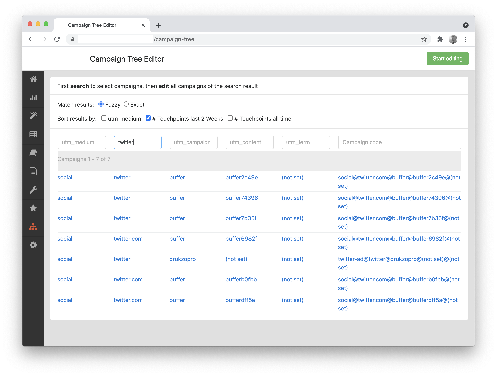
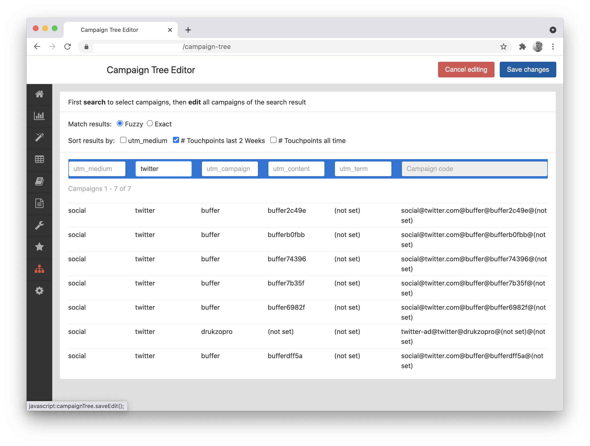

# Mara Campaign Tree Editor

Flask based Mara UI for correcting wrong UTM parameters or changing campaign structure. Stores mappings of "campaign codes" (concatenations of raw utm parameters as they appeared in tracking data) in a `campaign_tree` table in the Mara metadata database. 

Example: find all campaigns with "Twitter" in their `utm_source`:   
  

And then correct them to "Twitter":

# Usage

Have a look on [campaign_tree_editor/config.py](campaign_tree_editor/config.py) for setting up the UI.  

For updating the campaign tree with new campaign codes, call the `update` function in [campaign_tree_editor/campaign_tree.py](campaign_tree_editor/campaign_tree.py). 